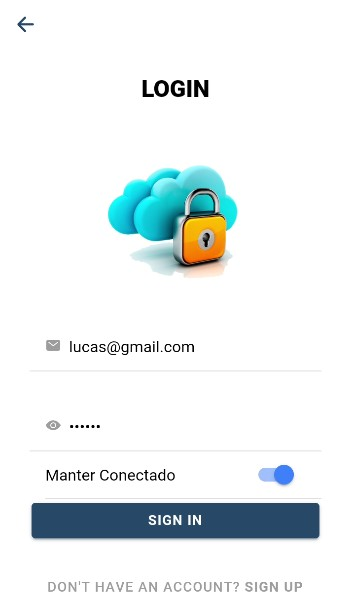
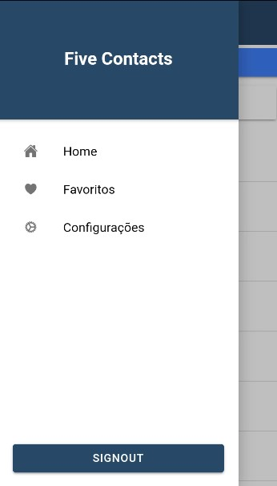

# Meu Closet (Ionic)
> Work for the discipline of Programming for mobile devices

The application has the purpose of saving Meu Closet from the list saved on the cell phone. Each user can have their list saved and for that, access to the cell phone contacts is made and also the cell phone calls to make the call.






## Development setup


```sh
npm install
ionic serve 
or to run in device
ionic cordova run android
```

